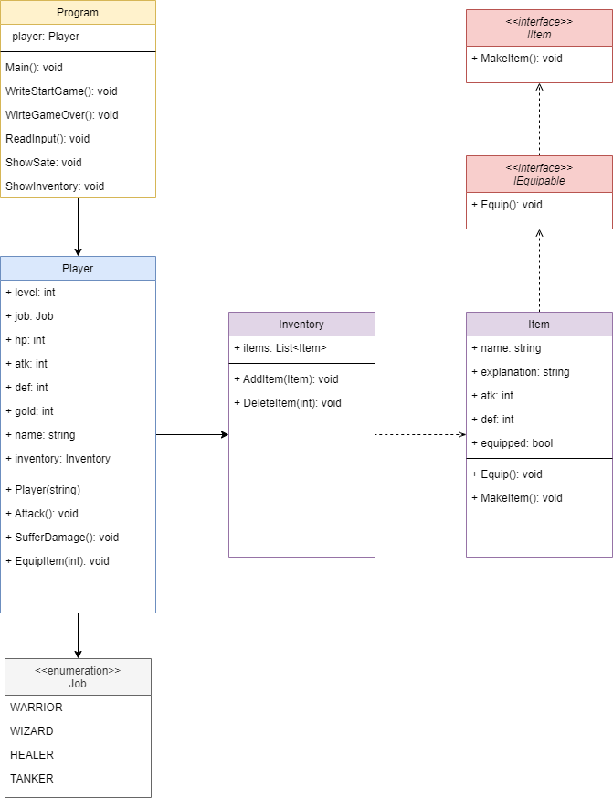

# 1. 게임 설명 및 개발 기간

## 1️⃣ 게임 설명

`SpartaTextGame`은 내일 배움 캠프 8기 Unity 프로그래밍 기초 개인 과제이다.

- **장르**: 콘솔 기반 Text게임
- **개요:** 던전을 떠나기 전 마을에서 장비 구성해 던전을 클리어하는 게임이다.
- **조작법:** 파랑색 배경으로 칠해진 텍스트의 번호를 누르면 해당 행동을 수행한다. 만약 다른 번호나 문자를 입력 시 안내 메시지가 뜬 후 다시 입력할 수 있다.

## 2️⃣ 개발 기간 `2023.08.21 ~ 2023.08.23`

- **`2023.08.18 (금) 12:00 ~ 13:00`**
    - 📝 발제(과제 안내)
- **`2023.08.21 (월)`**
    - 📝 필수 요구 사항 기능 명세서 작성
    - 🛠️ 필수 요구 사항 클래스 설계 및 클래스 다이어그램 제작
    - 👩‍💻 필수 요구사항 구현
- **`2023.8.22 (화)`**
    - 📝 선택 요구 사항 기능 명세서 작성
    - 🛠️ 선택 요구 사항 클래스 설계 및 클래스 다이어그램 제작
    - 👩‍💻  선택 요구사항 구현
- **`2023.08.23 (수)`**
    - 👩‍💻  선택 요구사항 구현

---

# 2. 진행 현황

아래의 필수 요구 사항은 모두 구현 완료한 상태이다.

🔽 **필수 요구 사항 목록**

- 게임 시작화면
- 상태보기
- 인벤토리
    - 인벤토리 - 장착 관리

아래의 선택 요구 사항 중 구현 완료한 기능은 ✅를, 현재 개발 중인 기능은 🔜를 앞에 표시했다.

🔽 **선택 요구사항 목록**

✅ 아이템 정보를 클래스 혹은 구조체를 활용해 구현하기

✅ 아이템 정보를 배열로 관리하기

✅ 아이템 추가하기 - 인벤토리에 나만의 새로운 아이템 추가해보기 (난이도 - ☆☆☆☆☆)

✅ 콘솔 꾸미기 (난이도 - ★☆☆☆☆)

✅ 인벤토리 아이템 이름, 설명 등의 글자 수에 따른 크기 맞춤 (난이도 - ★☆☆☆☆)

✅ 인벤토리 정렬 (이름, 장착, 공격력, 방어력 등을 기준으로) (난이도 - ★★★☆☆)

✅ 상점 - 아이템 구매 (난이도 - ★★★★☆)

🔜 상점 - 아이템 판매 (난이도 - ★★★☆☆)

🔜 장착 개선 (같은 종류의 아이템 중복 장착 X) (난이도 - ★★☆☆☆)

🔜 던전 입장 (난이도 - ★★★★☆)

🔜 휴식 기능 (난이도 - ★☆☆☆☆)

🔜 레벨업 기능 (난이도 - ★★☆☆☆

🔜 게임 저장 (난이도 - ★★★★★★)

---

# 3. 구현 내용

## 3-1. 게임 시작화면

게임 시작 시 간단한 소개와 수행 가능한 행동을 보여준다.

```csharp
**게임 시작 화면**
스파르타 마을에 오신 여러분 환영합니다.
이곳에서 던전으로 들어가기 전 활동을 할 수 있습니다.

1. 상태 보기
2. 인벤토리
3. 상점

원하시는 행동을 입력해주세요.
>>
```

## 3-2. 상태 보기

현재 플레이어의 정보를 확인할 수 있는 화면이다.

플레이어의 레벨, 직업, 공격력, 방어력, 체력, 보유 골드를 확인할 수 있다.

```csharp
**상태 보기**
캐릭터의 정보가 표시됩니다.

Lv. 01      
Chad ( 전사 )
공격력 : 10
방어력 : 5
체 력 : 100
Gold : 1500 G

0. 나가기

원하시는 행동을 입력해주세요.
>>
```

인벤토리에서 아이템을 장착하면 장착한 아이템의 효과를 괄호 안에 표시해준다.

```csharp
**상태 보기**
캐릭터의 정보가 표시됩니다.

Lv. 01      
Chad ( 전사 )
공격력 : 12 (+2)
방어력 : 10 (+5)
체 력 : 100
Gold : 1500 G

0. 나가기

원하시는 행동을 입력해주세요.
>>
```

## 3-3. 인벤토리

현재 보유중인 아이템들의 목록을 확인할 수 있으며, 아이템 장착 여부를 관리할 수 있다.

장착 중인 아이템은 이름 앞에 `[E]`가 표시된다.

```csharp
**인벤토리**
보유 중인 아이템을 관리할 수 있습니다.

[아이템 목록]
- [E]무쇠갑옷      | 방어력 +5 | 무쇠로 만들어져 튼튼한 갑옷입니다.
- 낡은 검         | 공격력 +2 | 쉽게 볼 수 있는 낡은 검 입니다.

1. 장착 관리
2. 아이템 정렬
0. 나가기

원하시는 행동을 입력해주세요.
>>
```

### ① 인벤토리 - 장착 관리

아이템 명 앞에 있는 번호를 눌러 해당 아이템을 장착 및 해제할 수 있다. 
이미 장착된 아이템을 다시 누를 경우 해제된다.

```csharp
**인벤토리 - 장착 관리**
보유 중인 아이템을 관리할 수 있습니다.

[아이템 목록]
- 1 [E]무쇠갑옷      | 방어력 +5 | 무쇠로 만들어져 튼튼한 갑옷입니다.
- 2 낡은 검         | 공격력 +2 | 쉽게 볼 수 있는 낡은 검입니다.

0. 나가기

원하시는 행동을 입력해주세요.
>>
```

### ② 인벤토리 - 아이템 정렬

정렬하고 싶은 기준의 번호를 누르면 아래와 같은 기준으로 아이템 목록을 정렬해서 확인할 수 있다.

1. 이름 
    - 이름 길이가 긴 아이템 순서대로
2. 장착순
    - 현재 장착 중인 아이템 순서대로
3. 공격력
    - 공격력이 큰 아이템 순서대로
4. 방어력
    - 방어력이 큰 아이템 순서대로

```csharp
**인벤토리 - 아이템 정렬**
보유 중인 아이템을 관리할 수 있습니다.

[아이템 목록]
- 1 [E]무쇠갑옷      | 방어력 +5 | 무쇠로 만들어져 튼튼한 갑옷입니다.
- 2 낡은 검         | 공격력 +2 | 쉽게 볼 수 있는 낡은 검입니다.

1. 이름
2. 장착순
3. 공격력
4. 방어력 
0. 나가기

원하시는 행동을 입력해주세요.
>>
```

## 3-4. 상점

새로운 아이템을 구매하고, 보유하고 있는 아이템을 원가의 85% 가격에 판매할 수 있다.

```csharp
**상점**
필요한 아이템을 얻을 수 있는 상점입니다.

[보유 골드]
800 G

[아이템 목록]
- 수련자 갑옷    | 방어력 +5  | 수련에 도움을 주는 갑옷입니다.             |  1000 G
- 무쇠갑옷      | 방어력 +9  | 무쇠로 만들어져 튼튼한 갑옷입니다.           |  구매완료
- 스파르타의 갑옷 | 방어력 +15 | 스파르타의 전사들이 사용했다는 전설의 갑옷입니다.|  3500 G
- 낡은 검      | 공격력 +2  | 쉽게 볼 수 있는 낡은 검 입니다.            |  600 G
- 청동 도끼     | 공격력 +5  |  어디선가 사용됐던거 같은 도끼입니다.        |  1500 G
- 스파르타의 창  | 공격력 +7  | 스파르타의 전사들이 사용했다는 전설의 창입니다. |  구매완료

1. 아이템 구매
2. 아이템 판매
0. 나가기

원하시는 행동을 입력해주세요.
>>
```

### ① 아이템 구매

사고 싶은 아이템의 번호를 누르면 구매 가능한 지 확인 후 구매할 수 있다.

이미 구매한 아이템은 가격 대신 `구매완료`로 표시되며, 다시 구매할 수 없다. 새로 구매한 아이템도 마찬가지이다.

보유한 돈이 아이템 가격보다 부족할 경우도 구매할 수 없다.

구매한 아이템은 인벤토리에서 확인할 수 있다.

```csharp
**상점 - 아이템 구매**
필요한 아이템을 얻을 수 있는 상점입니다.

[보유 골드]
800 G

[아이템 목록]
- 1 수련자 갑옷    | 방어력 +5  | 수련에 도움을 주는 갑옷입니다.             |  1000 G
- 2 무쇠갑옷      | 방어력 +9  | 무쇠로 만들어져 튼튼한 갑옷입니다.           |  구매완료
- 3 스파르타의 갑옷 | 방어력 +15 | 스파르타의 전사들이 사용했다는 전설의 갑옷입니다.|  3500 G
- 4 낡은 검      | 공격력 +2  | 쉽게 볼 수 있는 낡은 검 입니다.            |  600 G
- 5 청동 도끼     | 공격력 +5  |  어디선가 사용됐던거 같은 도끼입니다.        |  1500 G
- 6 스파르타의 창  | 공격력 +7  | 스파르타의 전사들이 사용했다는 전설의 창입니다. |  구매완료

0. 나가기

원하시는 행동을 입력해주세요.
>>
```

### ② 아이템 판매 (개발 중)

보유하고 있는 아이템 중 팔고 싶은 아이템의 번호를 입력하면 해당 아이템 원가의 85% 가격으로 팔 수 있다.

```csharp
**상점 - 아이템 판매**
필요한 아이템을 얻을 수 있는 상점입니다.

[보유 골드]
800 G

[아이템 목록]
- 1. 무쇠갑옷      | 방어력 +9  | 무쇠로 만들어져 튼튼한 갑옷입니다.           |  1800 G
- 2. 스파르타의 창  | 공격력 +7  | 스파르타의 전사들이 사용했다는 전설의 창입니다. |  2700 G

0. 나가기

원하시는 행동을 입력해주세요.
>>
```

---

# 4. 기능 명세서 및 클래스 다이어그램

## 1️⃣ 기능 명세서

[🔗 **스파르타 던전 (Text)게임 기능 명세서**](https://www.notion.so/Text-1032601976b64e60a2876d78b6a4bd39?pvs=21)

## 2️⃣ 클래스 다이어그램
사진 배경이 투명환 관계로 깃허브의 다크모드를 끈 상태에서 봐주시기 바랍니다.😅

**🔽 필수 요구사항 구현에 필요한 클래스 다이어그램 `설계 당시 모습`**



**🔽 필수 요구사항 구현에 필요한 클래스 다이어그램 `구현 후 수정된 모습`**

.png)

**🔽 선택 요구사항 구현에 필요한 클래스 다이어그램 `설계 당시 모습`**

.png)

초록색으로 표시된 부분: 수정 혹은 추가된 정보

🔽 **선택 요구사항 구현에 필요한 클래스 다이어그램 `구현 후 수정된 모습`**

구현 완료 후 클래스 다이어그램을 수정해 올릴 예정이다.
